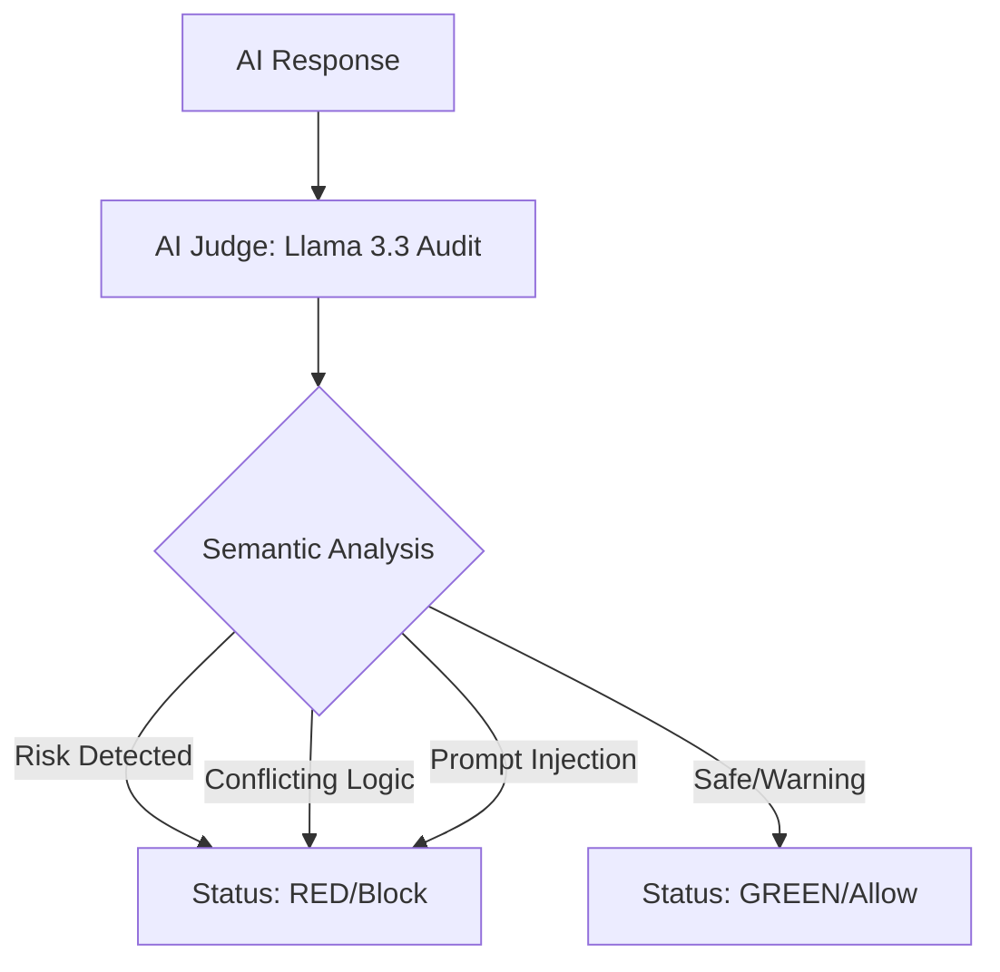

# MediTrust AI: Hybrid Medical Safety Firewall

A sophisticated two-layer verification system designed to prevent AI-generated medical hallucinations and safety violations. It ensures that medical assistants do not prescribe contraindicated medications based on specific patient conditions (e.g., allergies or organ failure).

## 🧠 Philosophy
Inspired by years of systemic data auditing, this tool addresses the critical issue of AI hallucinations in high-stakes environments.

**Real-world discovery:**
During testing, the AI Judge successfully flagged **'500ml Saline'** for a renal failure patient as a risk for fluid overload—a medical nuance missed by standard keyword filters but captured by our **Semantic Layer**.

## 🏗️ Architecture: Pure Semantic Firewall
Unlike traditional systems that rely on fragile "keyword lists" (Blacklists/Whitelists), MediTrust-AI-Firewall utilizes a **Pure Semantic Audit** approach:

- **Zero-Trust Logic**: Every response is treated as potentially risky until verified by the LLM-as-a-Judge.
- **Contextual Reasoning**: The system distinguishes between "prescribing" a drug (RED) and "warning" against it (GREEN).
- **Deterministic Output**: Uses Llama-3.3-70b with `temperature: 0` to ensure consistent, JSON-formatted safety verdicts.

## ⚙️ LLM Observability & CI/CD
To ensure continuous safety, this project integrates a fully automated **LLM Observability Pipeline**:
- **Automated Test Runner**: Validates the AI Judge against a strict baseline of medical edge cases, negations, and prompt injection (Jailbreak) attacks.
- **Continuous Integration (GitHub Actions)**: Every push triggers a semantic regression test suite to guarantee zero degradation in safety logic.
- **Automated Reporting**: Generates detailed markdown audit logs tracking AI reasoning and routing decisions.

## 🛠️ Tech Stack
- **Python 3.10+**
- **AI/LLM:** Llama-3.3-70b-versatile (Groq API)
- **DevOps/QA:** GitHub Actions (CI/CD), Automated Semantic Testing
- **Security:** Dotenv for API key protection

## 🚀 Getting Started
1. Clone the repository.
2. Install dependencies: pip install groq python-dotenv.
3. Create a .env file with your GROQ_API_KEY.
4. Run the production simulation: python app.py
5. Run the CI/CD test suite locally: python tests/test_runner.py